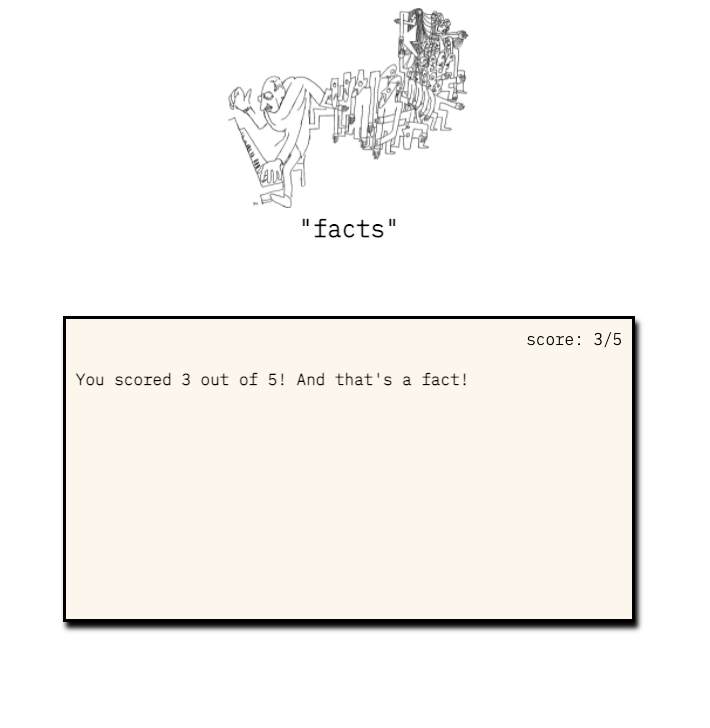

## this is a game called "facts"

 In this game, a player is presented a card with a quote, number, or bit of information. The player determines whether the "fact" will be true or false. Each game consists of five facts 

 The "facts" categories include: music, movies, sports, quotes, academia

## Getting Started: If you want to play the game, check it out here:   https://timcrisp94.github.io/facts-game/

## User Stories
<ul>
<li>AAU, I should see instructions for gameplay and a timer set for 60 seconds</li>
<li>AAU, I should see a notecard with a series of facts</li>
<li>AAU, I should see a true or false button</li>
<li>AAU, I should be able to click a True Button if I think the fact is true, or a false button if I think the fact is false</li>
<li>AAU, when I click the true button it should change color from gray to green, and from gray to red if I click the false button</li>
<li>AAU, I should receive a point for correctly guessing true or false</li>
<li>AAU, I should see a message related to the displayed fact after I've answered</li>
<li>AAU, the game will end when I have answered five facts or time has expired</li>
<li>AAU, I should see a game over message and a reset button</li>
</ul>

## Images
<ul>
  <li>Header 

  
  <li>Game Play

  

  <li>End Game 

  

## ⚙ Technologies used
<ul>
  <li>Javascript</li>
  <li>CSS</li>
  <li>HTML</li>
  <li>Google Fonts</li>
  <li>flexbox</li>
  <li>git</li>
</ul>

## ⚙ Icebox
<ul>
<li>Minimize Javascript 
<li>Create an introduction card
<li>Add to facts
</ul>

## Credits
<ul>
<li>[The work of David Markson](https://www.amazon.com/David-Markson/e/B000APBW8O%3Fref=dbs_a_mng_rwt_scns_share)
<li>[IMDB](https://www.imdb.com/)
<li>[Mixkit](https://mixkit.co/)
<li>Header image is a drawing of Igor Stravinsky by Jean Cocteau, sourced from the [New York Times](https://static01.nyt.com/images/2012/09/16/arts/16RITE2_SPAN/16JPRITE2-superJumbo.jpg?quality=75&auto=webp)